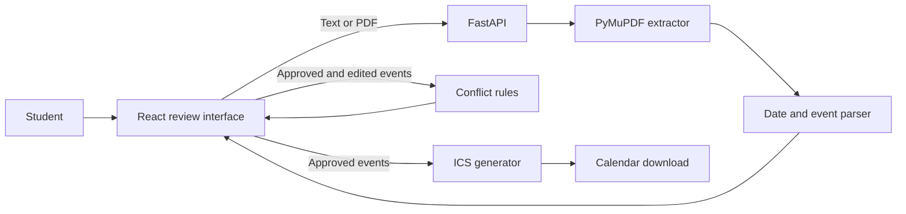

# CourseFlow Architecture

## Trust boundary

CourseFlow never treats extracted dates as automatically correct. The student sees source text and can edit, approve, or reject each item before export.
